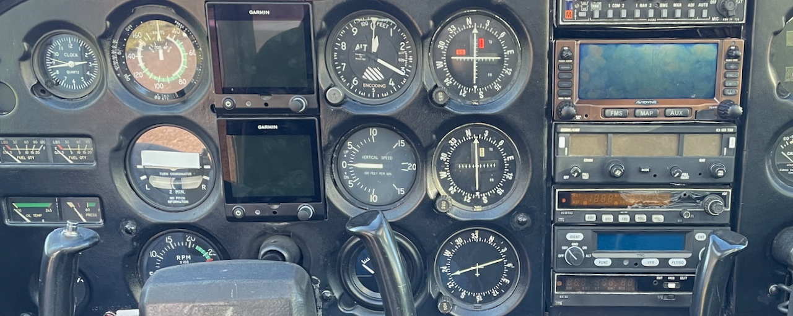

# panel-map

**Build interactive virtual cockpit instrument panels from a photo.**

`panel-map` turns a cockpit photo into a deployable web app where hovering an
instrument shows its picture and description, and clicking opens its manual. It
is two things in one repository:

1. **[`@staski/panel-map`](https://www.npmjs.com/package/@staski/panel-map)** — a
   small **Vue 3 component** that renders the interactive panel (the runtime).
2. A **vision-to-deploy toolchain** (`scripts/`) that goes from a cockpit photo
   to a ready-to-serve `dist.zip` — mostly automatically. Claude's vision detects
   and labels the instruments; deterministic tools validate, refine, enrich, and
   build.

> Designed for desktop displays — the layout puts an info card beside the panel,
> so it isn't intended for phones/tablets.

<!-- TODO: replace with a screenshot of the running app (panel + info-card popup) -->


---

## How it works

```
cockpit photo ─▶ vision (Claude) ─▶ areas.json ─▶ validate/clean ─▶ EDIT (browser)
                                                                          │
   dist.zip ◀─ npm build ◀─ sync assets ◀─ enrich ◀─ web-scale ◀─────────┘
```

- **areas.json** is the single source of truth — one file describing every
  instrument's box, title, description, picture and manual.
- Only the **edit** step is manual: a browser editor opens with the photo and
  boxes pre-loaded so you can nudge/rename/delete, then hit *Save*.
- Pictures, texts and manuals come from a reusable **instrument database**, and
  are loaded by the app **at runtime** — so you can swap them on the server
  without rebuilding.

See [`scripts/PANELMAP_WORKFLOW.md`](scripts/PANELMAP_WORKFLOW.md) for the full
workflow and [`scripts/INSTRUMENT_IDENTIFICATION.md`](scripts/INSTRUMENT_IDENTIFICATION.md)
for the instrument-recognition rules the vision pass follows.

---

## Quick start — photo → deployable app

```sh
git clone git@github.com:staski/panel-map.git
cd panel-map
npm install                 # on Apple Silicon, use: npm install --ignore-scripts

# after Claude has produced an areas.json for your photo:
scripts/build_panel.sh --image cockpit.jpg --areas areas.json --name mypanel --max-mb 1.5
```

`build_panel.sh` runs the whole pipeline — validate → **edit in the browser** →
web-scale the image → enrich from the catalog → sync assets from the database →
`npm run build` → package **`dist.zip`**. Deploy that anywhere (it matches the
`scripts/put.sh` / `scripts/update.sh` sftp-upload + unzip helpers).

Just want to develop the component or preview the demo?

```sh
npm run dev                 # local playground (uses the local component source)
```

---

## The `areas.json` contract

```json
{
  "name": "panel",
  "image": "images/cockpit.jpg",
  "areas": [
    {
      "title": "Airspeed Indicator",
      "shape": "circle",
      "coords": [232, 100, 60],
      "text": "Indicated airspeed in knots.",
      "img":  "images/airspeed.jpg",
      "doc":  "docs/airspeed.pdf"
    },
    { "title": "Garmin GNS430", "shape": "rect", "coords": [893, 63, 1197, 202] }
  ]
}
```

- **`title`** (required) — the human instrument name; the key the whole toolchain
  matches on.
- **`shape`** + **`coords`** (required) — `circle` = `[cx, cy, r]`, `rect` =
  `[x1, y1, x2, y2]`, in the image's natural pixel space.
- **`text` / `img` / `doc`** (optional) — description, popup picture, and manual.
  `enrich_areas.js` fills these from the catalog if you leave them out.
- **`image`** (top level) — the panel background photo, served to the app.

---

## Using the component (`@staski/panel-map`)

```sh
npm i @staski/panel-map     # peer dependency: vue ^3
```

```vue
<template>
  <PanelMap :src="imageUrl" :map="map" />
</template>

<script>
import PanelMap from '@staski/panel-map'
import '@staski/panel-map/style.css'      // bundled Bootstrap-based card styles

export default {
  components: { PanelMap },
  data() {
    return {
      imageUrl: '/images/cockpit.jpg',
      map: {
        name: 'my-panel',
        areas: [
          { title: 'Airspeed Indicator', shape: 'circle', coords: [232, 100, 60],
            text: 'Indicated airspeed in knots.',
            img: '/images/airspeed.jpg', href: '/docs/airspeed.pdf' },
          { title: 'Garmin GNS430', shape: 'rect', coords: [893, 63, 1197, 202] }
        ]
      }
    }
  }
}
</script>
```

| Prop  | Type   | Description |
|-------|--------|-------------|
| `src` | String | URL of the cockpit panel image |
| `map` | Object | `{ name, areas }` — see below |

Each **area**: `title`, `shape` (`rect`\|`circle`) and `coords` are required;
`text` (card description), `img` (popup picture URL) and `href` (manual opened on
click) are optional. The component scales the coords from the image's natural
size to the displayed size, so they always track the served image.

> The demo app (`src/App.vue`) fetches its `areas.json` at runtime and resolves
> the `img`/`doc` paths to URLs before passing them to the component — which is
> why assets can be replaced on the server without a rebuild.

---

## The toolchain (`scripts/`)

| Script | Role |
|--------|------|
| `panelmap_from_image.py` | validate & clean `areas.json` (+ optional overlay); `--dims` |
| `panelmap_editor.html`   | dependency-free **browser editor** — drag/resize/rename/delete, undo |
| `panelmap_refine.py`     | snap circles to instrument bezels (`ring` / `bbox` methods) |
| `scale_panel.py`         | downscale the image **and** coords together for the web |
| `enrich_areas.js`        | fill `img`/`text`/`doc` from `instrument_catalog.json` |
| `sync_assets.js`         | copy the referenced pictures/docs from the instrument DB into `public/` |
| `edit_server.py`         | serve the editor pre-loaded and receive the saved map (used by the pipeline) |
| `build_panel.sh`         | **orchestrator** — photo/areas.json → `dist.zip` |
| `instrument_catalog.json`| maps instrument types → standard picture, text and manual |

**Instrument database.** A directory (default `~/panelMap`, or `$PANELMAP_DB`)
laid out as `images/` and `docs/` — your reusable library of instrument pictures
and manuals. The catalog names the file each instrument type uses; `sync_assets`
copies just the ones a given panel references. `sync_assets` also runs on
`npm install` (`postinstall`).

---

## Repository layout

```
src/PanelMap/PanelMap.vue   the published @staski/panel-map component
src/App.vue, public/        the demo app (runtime-loads public/panel/areas.json)
scripts/                    the toolchain + docs (WORKFLOW / INSTRUMENT_IDENTIFICATION)
vite.config.js              app build (default: local component; --mode published)
vite.config-lib.js          library build → dist-lib/
```

## Development

```sh
npm run dev              # demo against the LOCAL component source (playground)
npm run dev:published    # demo against the published @staski/panel-map
npm run build            # build the app → dist/
npm run stage:lib        # build the library → dist-lib/  (then: cd dist-lib && npm publish)
```

The demo doubles as the component's development playground; `--mode published`
swaps in the real npm package to sanity-check the consumer path.

## Status

- **Component** — published on npm as `@staski/panel-map` (current: **1.0.3**).
- **Toolchain** — works end to end: vision → areas.json → edit → enrich → sync →
  build.
- **Automation** — one-command local build (`build_panel.sh`) is in place;
  generalising it to a server/CI environment is the next step.
- **Editor** — title editing is in; a couple of interaction refinements
  (double-click focus, in-field undo) are open.

## License

MIT — see [LICENSE](LICENSE). Copyright © 2023–2026 Carl Philipp Staszkiewicz.
